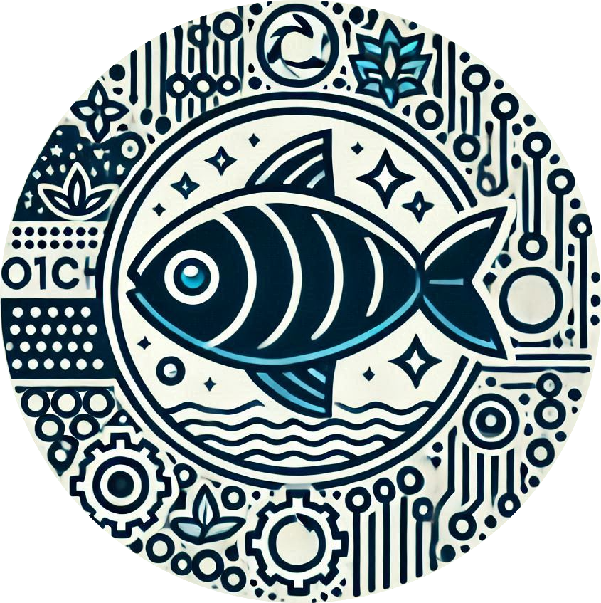

<div align="center">
<h1>Cyber Wooden Fish</h1>

<p></p>

</img>

[](./LICENSE)
</div>

### Description

The Cyber Wooden Fish platform is a playful and engaging crypto experience inspired by meme coins. Users can pump tokens using their smartphone's accelerometer combined with ZKTLS (zero-knowledge trust layer) for secure interactions. Token issuance is tied to earning merit points through platform activities, fostering meaningful engagement and social FOMO.

This project is designed to gamify meme coins, turning them into a dynamic cultural movement while blending technology, fun, and spirituality.


### **ShowCase**
vlayer prover: [0x8e42ab07232757cc0da117d2846ff981e3edcbdf](https://sepolia.scrollscan.com/address/0x8e42ab07232757cc0da117d2846ff981e3edcbdf)
- Scroll Sepolia: [0x062b414E562ca0983c55D4731640e2E664cB96e2](https://sepolia.scrollscan.com/address/0x062b414E562ca0983c55D4731640e2E664cB96e2#code)
- Flow: [0x8E42aB07232757CC0DA117d2846ff981E3eDCbdF](https://evm-testnet.flowscan.io/address/0x8E42aB07232757CC0DA117d2846ff981E3eDCbdF#code)

## What's inside?

This Turborepo includes the following packages/apps:

### Apps and Packages

- `apps/contract`: a token factory deploy by hardhat
- `apps/pwa`: a PWA vite app
- `apps/serverless`: a https protocol count user points
- `contract`: vlayer contract

Each package/app is 100% [TypeScript](https://www.typescriptlang.org/).

### Build

1. frontend

```
bun run build --filter pwa
```

2. backend

```
bun run deploy --filter serverless
```

3. contract
vlayer
```
cd contract/vlayer
bun run deploy:testnet
```
token factory
```
cd apps/contract
bun run deploy:tf
```
